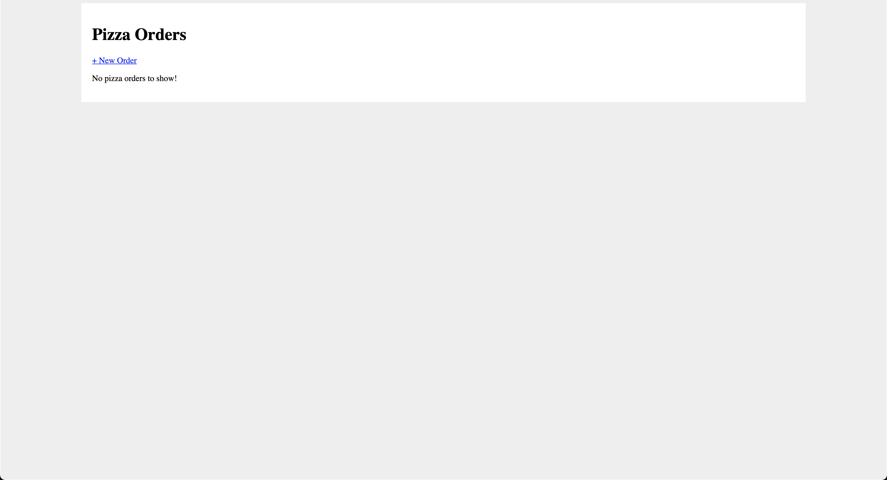
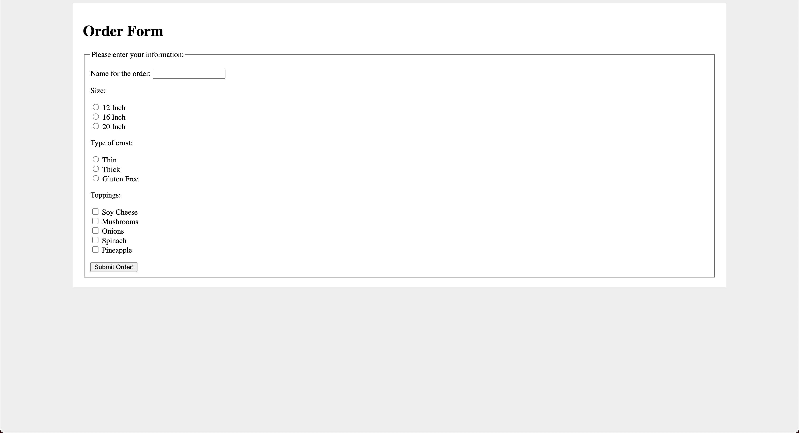
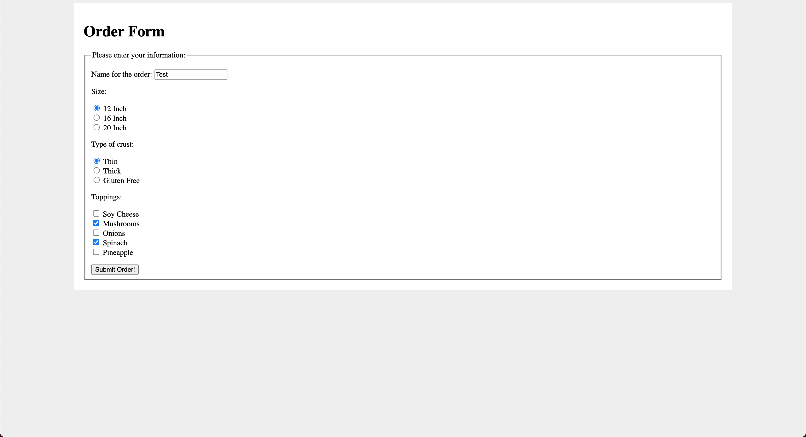
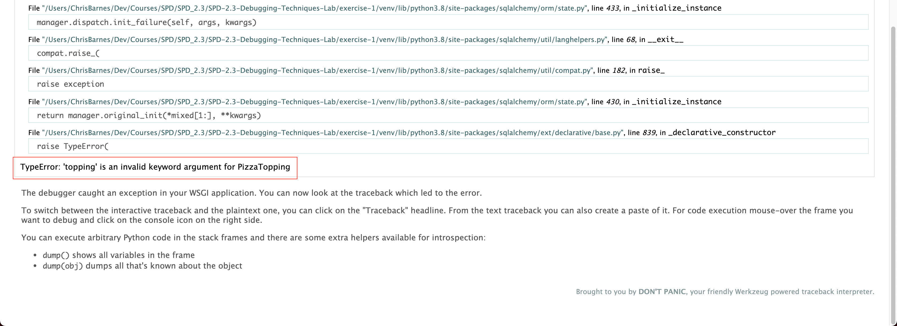

# Solutions

## 1. Look at the code tree / working directory

I notice the directories _static & templates_ and an app.py file. \
This tells me we are working on a Flask Project. \
Seeing a _.db_ file signifies we are working with a sql database.

## 2. Next we will look at the _Readme.md_

here we see the instructions of:

```zsh
  To run the code, open a terminal and navigate to the `exercise-1` folder, then run:

    pip3 install -r requirements.txt

  Then to run the server:

    python3 app.py
```

### !!Caution Before Installing Someoneelse's Dependancies, First Make Sure You Know A little about them.

#### I also advice running things in their own environment to Isolate things from your global dependancies.

If you don't already have one installed, let get virtualenv

```zsh
$ pip3 install virtualenv
$ virtualenv venv
created virtual environment
$ source venv/bin/activate
(venv) ➜  exercise-1 git:(main) ✗ 
```

Now lets install their requirements/dependancies

```zsh
(venv) ➜  exercise-1 git:(main) ✗ pip3 install -r requirements.txt
```

You should now be able to test locally

```zsh
(venv) ➜  exercise-1 git:(main) ✗ python3 app.py
* Serving Flask app "app" (lazy loading)
* Environment: production
   WARNING: This is a development server. Do not use it in a production deployment.
   Use a production WSGI server instead.
 * Debug mode: on
 * Running on http://127.0.0.1:5000/ (Press CTRL+C to quit)
 * Restarting with stat
 * Debugger is active!
 * Debugger PIN: 288-450-116
```

Lets visit the running server with http://127.0.0.1:5000/

## First Things We Notice

```zsh
127.0.0.1 - - [26/Jan/2021 18:12:37] "GET / HTTP/1.1" 200 -
127.0.0.1 - - [26/Jan/2021 18:12:37] "GET /static/style.css HTTP/1.1" 200 -
127.0.0.1 - - [26/Jan/2021 18:12:37] "GET /favicon.ico HTTP/1.1" 404 -
```

Here we can see a few things off the bat

1. We are on an unsecure connection in the first line _GET / HTTP/1.1_
2. We are able to access out _statics_ folder, and more specifically the _stlyes.css_.
3. We can not access/find a favicon (used for tab and bookmark display, helps ux/ui)

Here is the first render of the site, to Start their are no orders showing up.
So lets try and add one with the _+ New Order_ button/link





## Bug 1: Pizzas aren't being created or displayed?

```zsh
127.0.0.1 - - [26/Jan/2021 18:21:45] "GET /order HTTP/1.1" 200 -
None
127.0.0.1 - - [26/Jan/2021 18:26:13] "POST /order HTTP/1.1" 500 -
Traceback (most recent call last):

....

TypeError: 'topping' is an invalid keyword argument for PizzaTopping
127.0.0.1 - - [26/Jan/2021 18:26:13] "GET /order?__debugger__=yes&cmd=resource&f=style.css HTTP/1.1" 200 -
127.0.0.1 - - [26/Jan/2021 18:26:13] "GET /order?__debugger__=yes&cmd=resource&f=debugger.js HTTP/1.1" 200 -
127.0.0.1 - - [26/Jan/2021 18:26:13] "GET /order?__debugger__=yes&cmd=resource&f=jquery.js HTTP/1.1" 200 -
127.0.0.1 - - [26/Jan/2021 18:26:13] "GET /order?__debugger__=yes&cmd=resource&f=ubuntu.ttf HTTP/1.1" 200 -
127.0.0.1 - - [26/Jan/2021 18:26:13] "GET /order?__debugger__=yes&cmd=resource&f=console.png HTTP/1.1" 200 -
127.0.0.1 - - [26/Jan/2021 18:26:13] "GET /order?__debugger__=yes&cmd=resource&f=console.png HTTP/1.1" 200 -
```




----

### Bug 1: Analysis

  TypeError: 'topping' is an invalid keyword argument for PizzaTopping
  pizza.toppings.append(PizzaTopping(topping=topping_str))
  line 79 in pizza_order_submit

  From these debug/traceback statements, I suspect the topping_str variable is being set improperly. \
  So lets go have a look at the function pizza_order_submit on line 79 in app.py.

  | Label/VariableName |   HTML ID  |
  | ------------------ | ---------- |
  |     order_name     |    name    |
  |   pizza_size_str   |    size    |
  |   crust_type_str   | crust_type |
  |   toppings_list    |  topppings |

  The function acctually span lines 65 - 84. \
  It First takes in 4 requests from the order page.
  Then tries to construct and print the size of a Pizza object with the Variables: _order__name, pizza__size__str, crust__type__str_
  Next it tries to add the toppings from the list to the pizza, based off the availbe toppings?

### Bug 2: Discovered Redirect issue.

  It only returns ```None``` and a traceback error stating:
  ```werkzeug.routing.BuildError: Could not build url for endpoint '/'. Did you mean 'fulfill_order' instead?```

### Bug 2: Solution

  Due to using url_for() we must provide the function name rather than the path in @app.route(). After we update this we are able to navigate back to the main screen after ordering. This solves the traceback but it'd didnt create a pizza as indicated by the size being none.

  Back to 1: Creation Issues
  TypeError: 'topping' is an invalid keyword argument for PizzaTopping

  Next lets comment out lines 72 - 82, this being the creation of the pizza, adding of toppings, and saving the completed pizza to the database. Then let's add some print statements to debug the request calls to the input feilds.
    - Are these reasonable outputs?
    - Do we get the same values as we input?

  |  Option  |  Input  |   Output   |
  | -------- | ------- | ---------- |
  |   name   |   Test  |    None    |
  |   size   |    12   |    None    |
  |   crust  |  Thin   |    THIN    |
  | toppings |  Mushrooms, Spinach |  MUSHROOMS  |

### Bug 3.a: Discovered Request Issues

  From this we can see that the variables _order__name, pizza__size__str, & toppings__list_ are not being set/grabbed properly.

### Bug 3.a: Solution

  To solve this lets confirm that what we are grabbing is the same as what we are passing back. We need the name of each input to match the value we are looking for in our request statements. \

  Line 12

  ```HTML
    <input type="text" name="order_name">
  ```
  
  Lines 21/2

  ```HTML
    <input type="radio" name="pizza_size" value="{{ size.name }}">
      {{ size.value }}
  ```

  Lines 33/4
  
  ```HTML
    <input type="radio" name="crust_type" value="{{ crust_type.name }}">
      {{ crust_type.value }}
  ```

  Lines 45/6
  
  ```HTML
    <input type="checkbox" name="toppings" value="{{ topping.name }}">
      {{ topping.value }}
  ```

  Line 51
  
  ```HTML
    <input type="submit" value="Submit Order!">
  ```

  If we look back from aboe, we are requesting slightly different values for the names, being that the html inputs are slightly more verbose lets update our requests to match.

  From This:

  ```python3
    order_name = request.form.get('name')
    pizza_size_str = request.form.get('size')
    crust_type_str = request.form.get('crust_type')
    toppings_list = request.form.get('toppings')
  ```

  To This:

  ```python3
    order_name = request.form.get('order_name')
    pizza_size_str = request.form.get('pizza_size')
    crust_type_str = request.form.get('crust_type')
    toppings_list = request.form.get('toppings')
  ```

  This should fix the output values for the size and order name, However it doesn't look like we updated anything for the toppings as our original traceback suggested the error to be. \

### Bug 3.b: Discovered Issues with Toppings (Selection & Requests)

  One thing I did notice though is that the input for the toppings selection displays that you can select multiple optioins however that isn't accounted for in the html code. This is a simple fix, just add ```multiple``` to the end of the input.

  ```HTML
    <input type="checkbox" name="toppings" value="{{ topping.name }}" multiple>
      {{ topping.value }}
  ```

  Lets test things again and see what we get.
     - Are these reasonable outputs?
     - Do we get the same values as we input?

  |  Option  |  Input  |   Output   |
  | -------- | ------- | ---------- |
  |   name   |  Chris  |    Chris   |
  |   size   |   12    |    SMALL   |
  |   crust  |  Thin   |    THIN    |
  | toppings |  Mushrooms, Spinach |  MUSHROOMS  |

  This appears to have gotten us closer, lets uncomment the creation linesa and test again. We now get that the pizza is created and can return its size. However, the toppings seem to still be incorrect. This being the case, lets look at the next part of this function, the for loop.

### Bug 3.b: Solution

  To start lets add a print statement inside the loop to debug what is happening while we proccess the toppings. Running again we get.

  ```zsh
    ToppingType:  ToppingType.SOY_CHEESE
    ToppingType:  ToppingType.MUSHROOMS
    ToppingType:  ToppingType.ONIONS
    ToppingType:  ToppingType.SPINACH
    ToppingType:  ToppingType.PINEAPPLE
  ```

  This appears to be every option even though we only selected Mushroons & Spinach, and it only got MUSHROOMS. To me this signifies that we are looping over the wrong contents; Instead of ```for topping_str in ToppingType:``` we should be looping over the toppings_list via ```for topping_str in toppings_list:```. Closer but not quite...

  ```zsh
    order_name Chris 
    pizza_size_str SMALL 
    crust_type_str THIN 
    toppings_list MUSHROOMS

    size:  SMALL
    ToppingType:  M
    ToppingType:  U
    ToppingType:  S
    ToppingType:  H
    ToppingType:  R
    ToppingType:  O
    ToppingType:  O
    ToppingType:  M
    ToppingType:  S
  ```

  I belive this would be right if the toppings list propperly grabbed what we selected. To figure this out, I googled: ```flask get request only getting one selection on multiple objects``` and the first link was for this [stack overflow : Access Multiselect Form Field in Flask - Stack Overflowstackoverflow.com › questions › access-multiselect-for...](https://stackoverflow.com/questions/12502646/access-multiselect-form-field-in-flask) saying to change the ```.get``` to ```.getlsit```, and sure enough thanks to falsk auto refresh and it being a short form we now are seeing all the correct outputs on our debubg prints, but we're not done yet...
  
  Dunt Dunt Duntaaaaa ... We still have to make sure it add the toppings to the pizza correctly and then adds the pizza to the database.
  
  Now uncooment line 89 & 91 ```pizza.toppings.append(PizzaTopping(topping=topping_str))``` & ```db.session.add(pizza)``` and test again.

  Back to 1: Creation Issues
  TypeError: 'topping' is an invalid keyword argument for PizzaTopping

## Bug 1: Solution

  Change ```pizza.toppings.append(PizzaTopping(topping=topping_str))``` to \
  ```pizza.toppings.append(PizzaTopping(topping_type=topping_str))``` and add \
  ```db.session.commit()```
